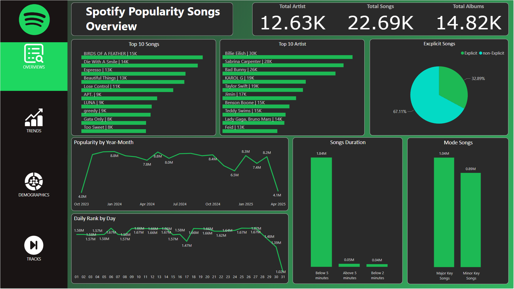
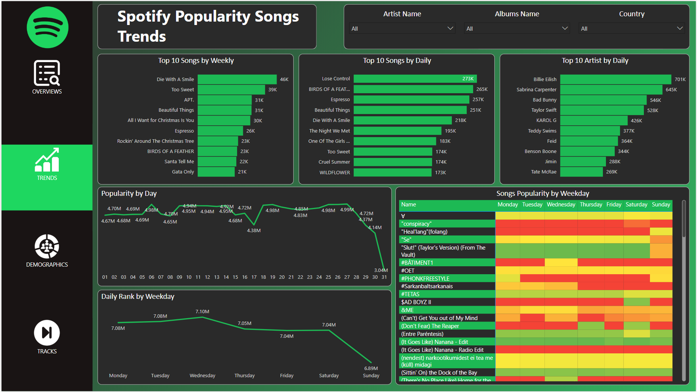
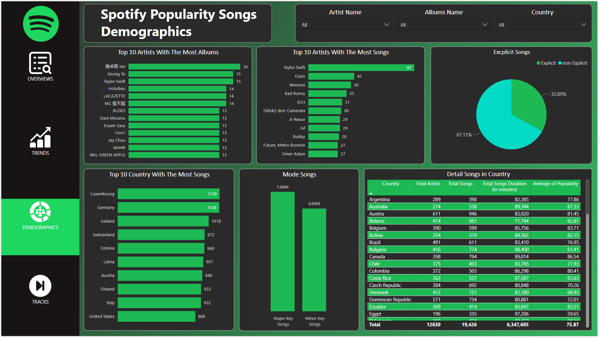
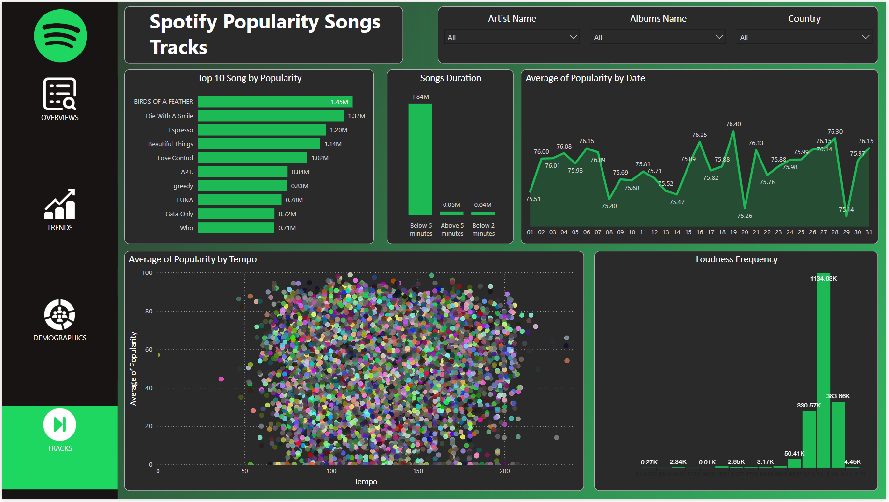

# Project Explanation: Real-Time Logistics Performance Overview

This Project I obtained the dataset from [Top Spotify Songs in 73 Countries](https://www.kaggle.com/datasets/asaniczka/top-spotify-songs-in-73-countries-daily-updated/data). I performed data cleaning using Python, Pandas and Numpy to ensure the dataset was ready for analysis. This project aims to provide in-depth insights into **popular songs**, as well as **song movement trends over a period of time**, **song characteristics**, and **popularity**.

## Dataset Column Explanation

- `spotify_id` = The unique identifier for the song in the Spotify database. (type: str)
- `name` = The title of the song. (type: str)
- `artists` = The name(s) of the artist(s) associated with the song. Do split(', ') to convert to a list (type: str)
- `daily_rank` = The daily rank of the song in the top 50 list. (type: int)
- `daily_movement` = The change in rankings compared to the previous day. (type: int)
- `weekly_movement` = The change in rankings compared to the previous week. (type: int)
- `country` = The ISO code of the country of the Top 50 Playlist. If Null, then the playlist if 'Global Top 50'. (type: str)
- `snapshot_date` = The date on which the data was collected from the Spotify API. (type: str)
- `popularity` = A measure of the song's current popularity on Spotify. (type: int)
- `is_explicit` = Indicates whether the song contains explicit lyrics. (type: bool)
- `duration_ms` = The duration of the song in milliseconds. (type: int)
- `album_name` = The title of the album the song belongs to. (type: str)
- `album_release_date` = The release date of the album the song belongs to. (type: str)
- `danceability` = A measure of how suitable the song is for dancing based on various musical elements. (type: float)
- `energy` = A measure of the intensity and activity level of the song. (type: float)
- `key` = The key of the song. (type: int)
- `loudness` = The overall loudness of the song in decibels. (type: float)
- `mode` = Indicates whether the song is in a major or minor key. (type: int)
- `speechiness` = A measure of the presence of spoken words in the song. (type: float)
- `acousticness` = A measure of the acoustic quality of the song. (type: float)
- `instrumentalness` = A measure of the likelihood that the song does not contain vocals. (type: float)
- `liveness` = A measure of the presence of a live audience in the recording. (type: float)
- `valence` = A measure of the musical positiveness conveyed by the song. (type: float)
- `tempo` = The tempo of the song in beats per minute. (type: float)
- `time_signature` = The estimated overall time signature of the song. (type: int)

---

# Insight of Visualization

## Overview

This first slide gives an overview of song popularity on Spotify. There are over **12,000 artists**, **22,000 songs**, and **14,800 albums** in the dataset. The most popular songs include **"BIRDS OF A FEATHER"** and "**Die With A Smile"**. Artists like **Billie Eilish** and **Sabrina Carpenter** are at the top. About **33%** of the songs are explicit, and most of the tracks are **under 5 minutes** long. The majority of the songs are in a **major key**, with fewer in a **minor key**. Song popularity fluctuates over time, peaking in **early 2024** and dropping sharply in **April 2025**. The daily rank shows how song popularity changes day by day.

## Trends

This slide shows the trends in song and artist popularity on Spotify, both weekly and daily. **"Die With A Smile"** and **"Lose Control"** are some of the most popular songs during certain weeks and days. **Billie Eilish** and **Sabrina Carpenter** are the top artists with the most listeners per day. The graph shows how song popularity fluctuates throughout the month, with some songs being more popular on specific days of the week. The heatmap at the bottom visually shows how song popularity changes depending on the day of the week.

## Demographics

This slide gives an overview of the demographic stats for songs on Spotify. **Eason Chan** and **Keung To** have the most albums, while **Taylor Swift** leads with the most songs. About **33%** of the songs are explicit. Countries like **Luxembourg** and **Germany** contribute the most songs to the dataset. **Major keys** are more common, with over **1 million** songs, while **minor keys** make up about **0.89 million**. It also shows detailed song data by country, showing total artists, total songs, total song duration and average popularity.

## Tracks

This slide gives insights into song popularity on Spotify based on factors like duration, tempo, and loudness. **"BIRDS OF A FEATHER"** leads in popularity, followed by **"Die With A Smile"** and **"Espresso"**. Most songs are under **5 minutes** long, with popularity fluctuating throughout the month, dipping slightly towards the end. There's no clear pattern between song tempo and its popularity. In terms of loudness, most songs have lower levels, though there are a few with higher loudness.

---

# Conclusion

In conclusion, from all the visualizations we've discussed, we can spot some interesting patterns in song popularity on Spotify. Shorter songs (under 5 minutes) dominate, and their popularity tends to vary depending on the time, with certain songs peaking in popularity on specific days or weeks. Big artists like **Billie Eilish**, **Taylor Swift**, and **Sabrina Carpenter** lead in daily listeners, while songs like **"BIRDS OF A FEATHER"** and **"Die With A Smile"** are at the top of the song popularity chart.

Additionally, while there's some fluctuation in popularity throughout the month, most songs are in a major key, and most have lower loudness levels, with only a few being louder. Overall, this visualization provides a clear picture of how song and artist popularity trends evolve on Spotify, and how factors like duration, tempo, and loudness play a role in shaping popular tracks.
